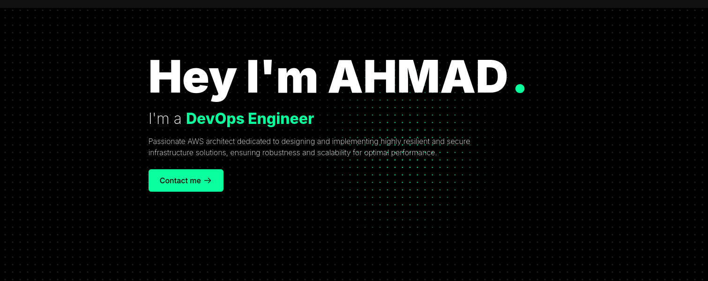
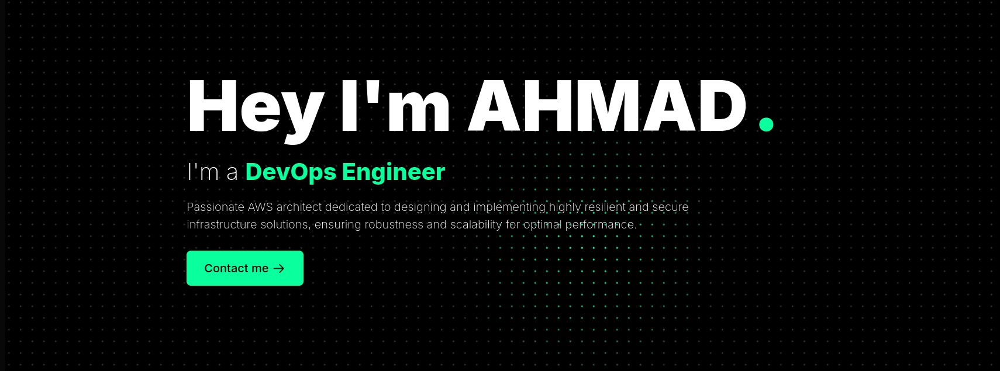

<!-- 
<h1 align="center">Hi 👋, I'm Ahmad Raza</h1>
<h3 align="center">A Passionate DevOps Engineer 🚀</h3> -->

<!--  -->

  
  
  
  

<h2 align="center">🛠 Skills</h2>

  
  
  
  
  
  
  
  
  
  
  
  
  
  
  
  
  
  

<h2 align="center">📈 Contribution Graph</h2>

  

<h2>📊 GitHub Stats</h2>
  
  
  <!--  -->

<!-- 
<h2>🔝 Top Languages</h2>
  

<h2>🔥 Streak Stats</h2>
  

 -->

<!-- <h2>🏆 Achievements</h2>
  
 -->

## TOP Projects 🛠️

- [**Docs Platform**](https://docs.ahmadraza.in)
- [**AWS S3 Navigator**](https://github.com/ahmadrazalab/AWS-S3-Explorer)
- [**Kubernetes-as-Terraform**](https://github.com)
- [**Terraform-AWS-Stack**](https://github.com/ahmadrazalab/enterprize-tf-lab)
- [**Kafka-AS-Docker**](https://github.com/ahmadrazalab/Fork-kafka-as-docker-django-y)

## Our Sites & Services 🌐

Explore our open-source DevOps support organization and the valuable resources we offer:

- **[Dockerizeit](https://dockerizeit.cloud)** - Our OpenSource platform for OPS support.
- **[DevOps Docs](https://docs.ahmadraza.in)** - Comprehensive guides and tutorials.
- **[Services](https://services.ahmadraza.in)** - Connect us for freelance support and services. 

<!-- ## Videos 📹

<VideoEmbed src="https://www.youtube.com/watch?v=YOUR_VIDEO_ID" />
 -->

<h2 align="center">📫 Connect with me</h2>

  
  
  

> Thank you for visiting my profile! Feel free to connect with me and explore my projects. 🚀

---

